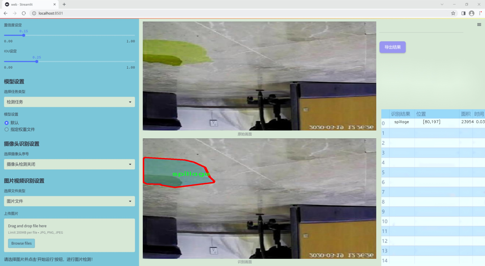
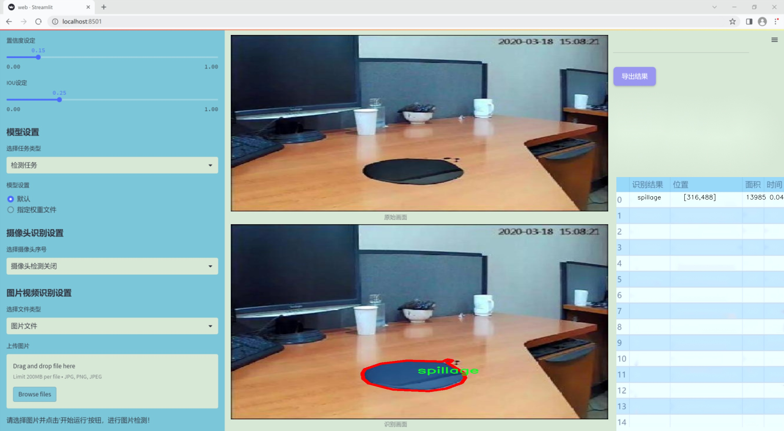
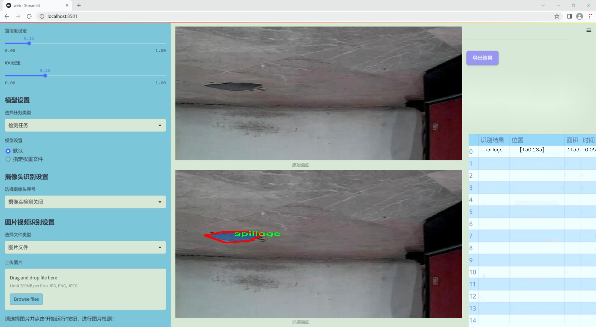
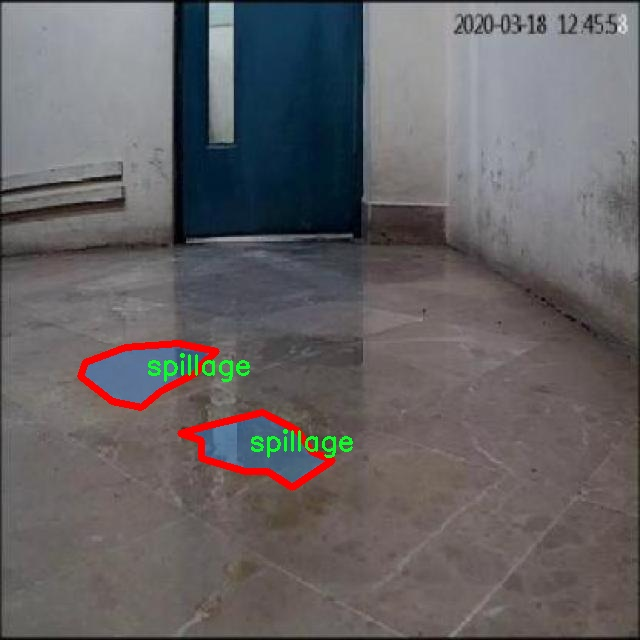
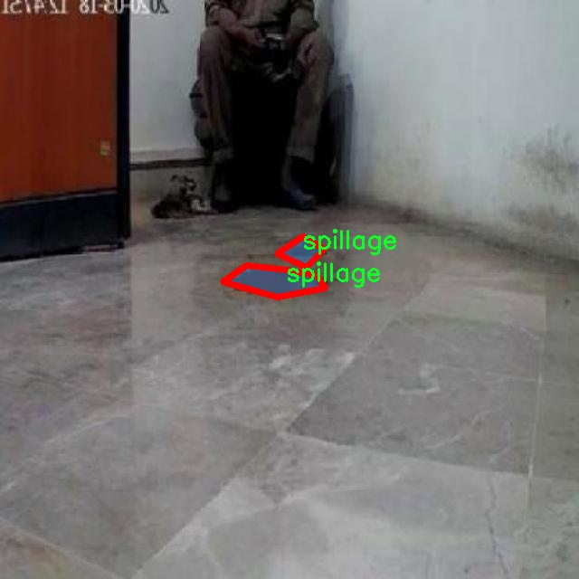
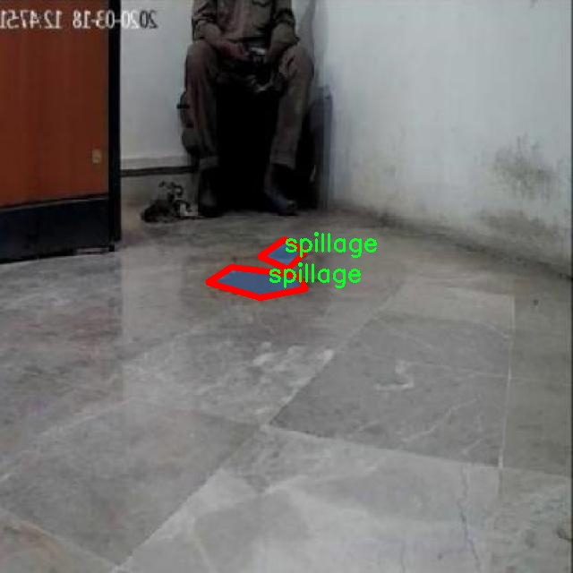
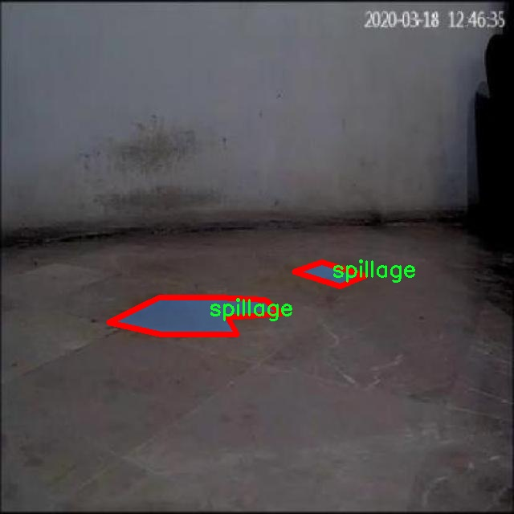
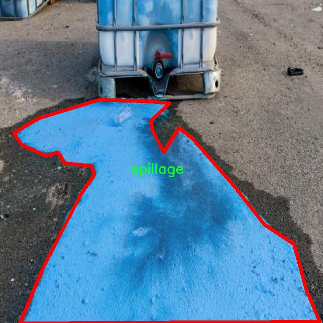

### 1.背景意义

研究背景与意义

液体泼溅现象在许多领域中都具有重要的实际意义，例如环境监测、工业生产和安全管理等。液体泼溅不仅可能导致环境污染，还可能对设备和人员造成潜在的安全隐患。因此，准确识别和分割液体泼溅图像，对于及时采取措施、降低风险具有重要的现实意义。近年来，随着计算机视觉技术的快速发展，深度学习尤其是卷积神经网络（CNN）在图像分割任务中表现出了卓越的性能。YOLO（You Only Look Once）系列模型因其高效的实时检测能力而广泛应用于目标检测和图像分割任务中。

本研究旨在基于改进的YOLOv11模型，构建一个高效的液体泼溅图像分割系统。该系统将利用一个包含2485张图像的数据集，专注于液体泼溅的检测与分割。该数据集仅包含一个类别，即“spillage”，并采用YOLOv8格式进行标注，确保了数据的规范性和一致性。通过对数据集的深入分析与处理，研究将探讨如何通过改进YOLOv11模型的结构和算法，提升液体泼溅图像的分割精度和实时性。

此外，液体泼溅图像分割系统的研究不仅可以为工业和环境领域提供技术支持，还能为智能监控、自动化生产等应用场景提供重要的技术基础。通过实现高效的液体泼溅检测与分割，能够为相关领域的决策提供数据支持，进而推动相关技术的进步与应用。因此，本研究具有重要的理论价值和实际应用前景，为未来的研究提供了新的思路和方向。

### 2.视频效果

[2.1 视频效果](https://www.bilibili.com/video/BV1y4UVYkEhk/)

### 3.图片效果







##### [项目涉及的源码数据来源链接](https://kdocs.cn/l/cszuIiCKVNis)**

注意：本项目提供训练的数据集和训练教程,由于版本持续更新,暂不提供权重文件（best.pt）,请按照6.训练教程进行训练后实现上图演示的效果。

### 4.数据集信息

##### 4.1 本项目数据集类别数＆类别名

nc: 1
names: ['spillage']


该项目为【图像分割】数据集，请在【训练教程和Web端加载模型教程（第三步）】这一步的时候按照【图像分割】部分的教程来训练

##### 4.2 本项目数据集信息介绍

本项目数据集信息介绍

本项目旨在开发一个改进版的YOLOv11液体泼溅图像分割系统，为此我们构建了一个专门的数据集，命名为“spillage-1-”。该数据集专注于液体泼溅现象的图像识别与分割，涵盖了多种液体在不同环境下的泼溅场景。数据集中包含了丰富的图像样本，旨在为模型提供足够的训练数据，以提高其在液体泼溅检测和分割任务中的准确性和鲁棒性。

数据集的类别数量为1，主要针对“spillage”这一主题进行深入研究。该类别包含了多种液体泼溅的情况，如水、油、果汁等，涉及不同的泼溅角度、速度和环境条件。这种多样性使得模型能够在不同的实际应用场景中表现出色。数据集中所收集的图像均经过精心标注，确保每个泼溅现象都能被准确识别和分割，进而为后续的深度学习模型训练提供高质量的基础。

在数据集的构建过程中，我们注重图像的多样性和代表性，力求涵盖各种可能的液体泼溅情况，以便模型能够学习到液体在不同条件下的动态特征。此外，数据集还包括了不同光照条件、背景环境和液体性质的图像，以增强模型的泛化能力。通过对“spillage”类别的深入挖掘和细致标注，我们希望能够为液体泼溅图像分割领域的研究提供一个坚实的数据基础，推动相关技术的进步与应用。











### 5.全套项目环境部署视频教程（零基础手把手教学）

[5.1 所需软件PyCharm和Anaconda安装教程（第一步）](https://www.bilibili.com/video/BV1BoC1YCEKi/?spm_id_from=333.999.0.0&vd_source=bc9aec86d164b67a7004b996143742dc)


[5.2 安装Python虚拟环境创建和依赖库安装视频教程（第二步）](https://www.bilibili.com/video/BV1ZoC1YCEBw?spm_id_from=333.788.videopod.sections&vd_source=bc9aec86d164b67a7004b996143742dc)

### 6.改进YOLOv11训练教程和Web_UI前端加载模型教程（零基础手把手教学）

[6.1 改进YOLOv11训练教程和Web_UI前端加载模型教程（第三步）](https://www.bilibili.com/video/BV1BoC1YCEhR?spm_id_from=333.788.videopod.sections&vd_source=bc9aec86d164b67a7004b996143742dc)


按照上面的训练视频教程链接加载项目提供的数据集，运行train.py即可开始训练



     Epoch   gpu_mem       box       obj       cls    labels  img_size
     1/200     20.8G   0.01576   0.01955  0.007536        22      1280: 100%|██████████| 849/849 [14:42<00:00,  1.04s/it]
               Class     Images     Labels          P          R     mAP@.5 mAP@.5:.95: 100%|██████████| 213/213 [01:14<00:00,  2.87it/s]
                 all       3395      17314      0.994      0.957      0.0957      0.0843

     Epoch   gpu_mem       box       obj       cls    labels  img_size
     2/200     20.8G   0.01578   0.01923  0.007006        22      1280: 100%|██████████| 849/849 [14:44<00:00,  1.04s/it]
               Class     Images     Labels          P          R     mAP@.5 mAP@.5:.95: 100%|██████████| 213/213 [01:12<00:00,  2.95it/s]
                 all       3395      17314      0.996      0.956      0.0957      0.0845

     Epoch   gpu_mem       box       obj       cls    labels  img_size
     3/200     20.8G   0.01561    0.0191  0.006895        27      1280: 100%|██████████| 849/849 [10:56<00:00,  1.29it/s]
               Class     Images     Labels          P          R     mAP@.5 mAP@.5:.95: 100%|███████   | 187/213 [00:52<00:00,  4.04it/s]
                 all       3395      17314      0.996      0.957      0.0957      0.0845


###### [项目数据集下载链接](https://kdocs.cn/l/cszuIiCKVNis)

### 7.原始YOLOv11算法讲解


##### YOLOv11三大损失函数

YOLOv11（You Only Look Once）是一种流行的目标检测算法，其损失函数设计用于同时优化分类和定位任务。YOLO的损失函数通常包括几个部分：
**分类损失、定位损失（边界框回归损失）和置信度损失** 。其中，

  1. box_loss（边界框回归损失）是用于优化预测边界框与真实边界框之间的差异的部分。

  2. cls_loss（分类损失）是用于优化模型对目标类别的预测准确性的部分。分类损失确保模型能够正确地识别出图像中的对象属于哪个类别。

  3. dfl_loss（Distribution Focal Loss）是YOLO系列中的一种损失函数，特别是在一些改进版本如YOLOv5和YOLOv7中被引入。它的主要目的是解决目标检测中的类别不平衡问题，并提高模型在处理小目标和困难样本时的性能。

##### 边界框回归损失详解

box_loss（边界框回归损失）是用于优化预测边界框与真实边界框之间的差异的部分。


##### box_loss 的具体意义


##### 为什么需要 box_loss

  * 精确定位：通过最小化中心点坐标损失和宽高损失，模型能够更准确地预测目标的位置和大小。
  * 平衡不同类型的目标：使用平方根来处理宽高损失，可以更好地平衡不同大小的目标，确保小目标也能得到足够的关注。
  * 稳定训练：适当的损失函数设计有助于模型的稳定训练，避免梯度爆炸或消失等问题。

##### 分类损失详解

在YOLO（You Only Look
Once）目标检测算法中，cls_loss（分类损失）是用于优化模型对目标类别的预测准确性的部分。分类损失确保模型能够正确地识别出图像中的对象属于哪个类别。下面是关于cls_loss的详细解读：

##### 分类损失 (cls_loss) 的具体意义

  
分类损失通常使用交叉熵损失（Cross-Entropy
Loss）来计算。交叉熵损失衡量的是模型预测的概率分布与真实标签之间的差异。在YOLO中，分类损失的具体形式如下：


##### 为什么需要 cls_loss

  * 类别识别：cls_loss 确保模型能够正确识别出图像中的目标属于哪个类别。这对于目标检测任务至关重要，因为不仅需要知道目标的位置，还需要知道目标的类型。

  * 多类别支持：通过最小化分类损失，模型可以处理多个类别的目标检测任务。例如，在道路缺陷检测中，可能需要识别裂缝、坑洞、路面破损等多种类型的缺陷。

  * 提高准确性：分类损失有助于提高模型的分类准确性，从而提升整体检测性能。通过优化分类损失，模型可以更好地学习不同类别之间的特征差异。

##### 分布损失详解

`dfl_loss`（Distribution Focal
Loss）是YOLO系列中的一种损失函数，特别是在一些改进版本如YOLOv5和YOLOv7中被引入。它的主要目的是解决目标检测中的类别不平衡问题，并提高模型在处理小目标和困难样本时的性能。下面是对`dfl_loss`的详细解读：

##### DFL Loss 的背景

在目标检测任务中，类别不平衡是一个常见的问题。某些类别的样本数量可能远远多于其他类别，这会导致模型在训练过程中对常见类别的学习效果较好，而对罕见类别的学习效果较差。此外，小目标和困难样本的检测也是一个挑战，因为这些目标通常具有较少的特征信息，容易被忽略或误分类。

为了应对这些问题，研究者们提出了多种改进方法，其中之一就是`dfl_loss`。`dfl_loss`通过引入分布焦点损失来增强模型对困难样本的关注，并改善类别不平衡问题。

##### DFL Loss 的定义

DFL Loss
通常与传统的交叉熵损失结合使用，以增强模型对困难样本的学习能力。其核心思想是通过对每个类别的预测概率进行加权，使得模型更加关注那些难以正确分类的样本。

DFL Loss 的公式可以表示为：


##### DFL Loss 的具体意义**

  * **类别不平衡：** 通过引入平衡因子 α，DFL Loss 可以更好地处理类别不平衡问题。对于少数类别的样本，可以通过增加其权重来提升其重要性，从而提高模型对这些类别的检测性能。
  *  **困难样本：** 通过聚焦参数 γ，DFL Loss 可以让模型更加关注那些难以正确分类的样本。当 
  * γ 较大时，模型会对那些预测概率较低的样本给予更多的关注，从而提高这些样本的分类准确性。
  *  **提高整体性能** ：DFL Loss 结合了传统交叉熵损失的优势，并通过加权机制增强了模型对困难样本的学习能力，从而提高了整体的检测性能。


### 8.200+种全套改进YOLOV11创新点原理讲解

#### 8.1 200+种全套改进YOLOV11创新点原理讲解大全

由于篇幅限制，每个创新点的具体原理讲解就不全部展开，具体见下列网址中的改进模块对应项目的技术原理博客网址【Blog】（创新点均为模块化搭建，原理适配YOLOv5~YOLOv11等各种版本）

[改进模块技术原理博客【Blog】网址链接](https://gitee.com/qunmasj/good)


#### 8.2 精选部分改进YOLOV11创新点原理讲解

###### 这里节选部分改进创新点展开原理讲解(完整的改进原理见上图和[改进模块技术原理博客链接](https://gitee.com/qunmasj/good)【如果此小节的图加载失败可以通过CSDN或者Github搜索该博客的标题访问原始博客，原始博客图片显示正常】
### CBAM空间注意力机制
近年来，随着深度学习研究方向的火热，注意力机制也被广泛地应用在图像识别、语音识别和自然语言处理等领域，注意力机制在深度学习任务中发挥着举足轻重的作用。注意力机制借鉴于人类的视觉系统，例如，人眼在看到一幅画面时，会倾向于关注画面中的重要信息，而忽略其他可见的信息。深度学习中的注意力机制和人类视觉的注意力机制相似，通过扫描全局数据，从大量数据中选择出需要重点关注的、对当前任务更为重要的信息，然后对这部分信息分配更多的注意力资源，从这些信息中获取更多所需要的细节信息，而抑制其他无用的信息。而在深度学习中，则具体表现为给感兴趣的区域更高的权重，经过网络的学习和调整，得到最优的权重分配，形成网络模型的注意力，使网络拥有更强的学习能力，加快网络的收敛速度。
注意力机制通常可分为软注意力机制和硬注意力机制[4-5]。软注意力机制在选择信息时，不是从输入的信息中只选择1个，而会用到所有输入信息，只是各个信息对应的权重分配不同，然后输入网络模型进行计算;硬注意力机制则是从输入的信息中随机选取一个或者选择概率最高的信息，但是这一步骤通常是不可微的，导致硬注意力机制更难训练。因此，软注意力机制应用更为广泛，按照原理可将软注意力机制划分为:通道注意力机制（channel attention)、空间注意力机制(spatial attention）和混合域注意力机制(mixed attention)。
通道注意力机制的本质建立各个特征通道之间的重要程度，对感兴趣的通道进行重点关注，弱化不感兴趣的通道的作用;空间注意力的本质则是建模了整个空间信息的重要程度，然后对空间内感兴趣的区域进行重点关注，弱化其余非感兴趣区域的作用;混合注意力同时运用了通道注意力和空间注意力，两部分先后进行或并行，形成对通道特征和空间特征同时关注的注意力模型。

卷积层注意力模块(Convolutional Block Attention Module，CBAM）是比较常用的混合注意力模块，其先后集中了通道注意力模块和空间注意力模块，网络中加入该模块能有效提高网络性能，减少网络模型的计算量，模块结构如图所示。输入特征图首先经过分支的通道注意力模块，然后和主干的原特征图融合，得到具有通道注意力的特征图，接着经过分支的空间注意力模块，在和主干的特征图融合后，得到同时具有通道特征注意力和空间特征注意力的特征图。CBAM模块不改变输入特征图的大小，因此该模块是一个“即插即用”的模块，可以插入网络的任何位置。

通道注意力模块的结构示意图如图所示，通道注意力模块分支并行地对输入的特征图进行最大池化操作和平均池化操作，然后利用多层感知机对结果进行变换，得到应用于两个通道的变换结果，最后经过sigmoid激活函数将变换结果融合，得到具有通道注意力的通道特征图。

空间注意力模块示意图如图所示，将通道注意力模块输出的特征图作为该模块的输入特征图，首先对输入特征图进行基于通道的最大池化操作和平均池化操作，将两部分得到的结果拼接起来，然后通过卷积得到降为Ⅰ通道的特征图，最后通过sigmoid激活函数生成具有空间注意力的特征图。


### 9.系统功能展示

图9.1.系统支持检测结果表格显示

  图9.2.系统支持置信度和IOU阈值手动调节

  图9.3.系统支持自定义加载权重文件best.pt(需要你通过步骤5中训练获得)

  图9.4.系统支持摄像头实时识别

  图9.5.系统支持图片识别

  图9.6.系统支持视频识别

  图9.7.系统支持识别结果文件自动保存

  图9.8.系统支持Excel导出检测结果数据


### 10. YOLOv11核心改进源码讲解

#### 10.1 TransNext.py

以下是对给定代码的核心部分进行分析和详细注释的结果：

```python
try:
    # 尝试导入swattention模块和TransNext_cuda中的所有内容
    import swattention
    from ultralytics.nn.backbone.TransNeXt.TransNext_cuda import *
except ImportError as e:
    # 如果导入失败（通常是因为没有安装CUDA版本），则导入TransNext_native中的所有内容
    from ultralytics.nn.backbone.TransNeXt.TransNext_native import *
    pass
```

### 代码分析与注释

1. **导入模块**：
   - `try`语句块用于尝试执行可能会引发异常的代码。在这里，首先尝试导入`swattention`模块以及`TransNext_cuda`中的所有内容。
   - `import swattention`：这是一个自定义或第三方库，可能用于实现某种注意力机制（Attention Mechanism）。
   - `from ultralytics.nn.backbone.TransNeXt.TransNext_cuda import *`：尝试从`TransNext_cuda`模块导入所有定义的内容。`TransNext_cuda`可能是一个基于CUDA的高效实现，适用于具有GPU加速的深度学习任务。

2. **异常处理**：
   - `except ImportError as e`：如果在`try`块中发生`ImportError`，则执行此块的代码。`ImportError`通常表示所需的模块未找到或无法导入。
   - `from ultralytics.nn.backbone.TransNeXt.TransNext_native import *`：在导入CUDA版本失败后，导入`TransNext_native`模块的所有内容。`TransNext_native`可能是一个纯CPU实现，适用于没有CUDA支持的环境。

3. **`pass`语句**：
   - `pass`是一个空语句，表示在异常处理块中不执行任何操作。它的存在是为了保持代码结构的完整性。

### 总结
这段代码的核心功能是根据系统的环境条件选择合适的模块进行导入。如果CUDA支持可用，则使用GPU加速的实现；如果不可用，则回退到CPU实现。这种设计使得代码在不同的硬件环境下具有更好的兼容性和灵活性。

这个文件名为 `TransNext.py`，主要功能是导入与 `TransNeXt` 相关的模块。代码的第一部分尝试导入 `swattention` 模块以及 `TransNext_cuda` 中的内容，这通常意味着该模块可能是一个使用 CUDA 加速的实现，适用于支持 GPU 的环境。

如果在导入过程中遇到 `ImportError`（即无法找到或加载指定的模块），代码会进入 `except` 块。在这个块中，它会尝试导入 `TransNext_native` 模块。这通常表示该模块是一个不依赖于 CUDA 的实现，适用于不支持 GPU 的环境。

通过这种方式，程序能够根据运行环境的不同，灵活选择合适的模块进行导入，从而确保在不同的硬件条件下都能正常运行。这种设计提高了代码的兼容性和灵活性，使得用户在不同的计算环境中都能使用 `TransNeXt` 的功能。

#### 10.2 UniRepLKNet.py

以下是代码中最核心的部分，并附上详细的中文注释：

```python
import torch
import torch.nn as nn
import torch.nn.functional as F

class GRNwithNHWC(nn.Module):
    """ GRN (全局响应归一化) 层
    该层用于对输入进行归一化处理，提升模型的性能。
    输入假设为 (N, H, W, C) 格式。
    """
    def __init__(self, dim, use_bias=True):
        super().__init__()
        self.use_bias = use_bias
        # gamma 和 beta 是可学习的参数
        self.gamma = nn.Parameter(torch.zeros(1, 1, 1, dim))
        if self.use_bias:
            self.beta = nn.Parameter(torch.zeros(1, 1, 1, dim))

    def forward(self, x):
        # 计算输入的 L2 范数
        Gx = torch.norm(x, p=2, dim=(1, 2), keepdim=True)
        # 计算归一化因子
        Nx = Gx / (Gx.mean(dim=-1, keepdim=True) + 1e-6)
        if self.use_bias:
            return (self.gamma * Nx + 1) * x + self.beta
        else:
            return (self.gamma * Nx + 1) * x

class UniRepLKNetBlock(nn.Module):
    """ UniRepLKNet 的基本模块
    该模块包含深度卷积、归一化、激活函数等。
    """
    def __init__(self, dim, kernel_size, drop_path=0., deploy=False, attempt_use_lk_impl=True):
        super().__init__()
        # 深度卷积层
        self.dwconv = nn.Conv2d(dim, dim, kernel_size=kernel_size, stride=1, padding=kernel_size // 2, groups=dim, bias=True)
        # 归一化层
        self.norm = nn.BatchNorm2d(dim)
        # Squeeze-and-Excitation (SE) 模块
        self.se = SEBlock(dim, dim // 4)
        # 前馈网络
        ffn_dim = dim * 4
        self.pwconv1 = nn.Linear(dim, ffn_dim)
        self.act = nn.GELU()
        self.pwconv2 = nn.Linear(ffn_dim, dim)

    def forward(self, inputs):
        # 前向传播
        y = self.dwconv(inputs)  # 深度卷积
        y = self.norm(y)         # 归一化
        y = self.se(y)           # SE 模块
        y = self.pwconv1(y)      # 前馈网络第一层
        y = self.act(y)          # 激活函数
        y = self.pwconv2(y)      # 前馈网络第二层
        return y + inputs        # 残差连接

class UniRepLKNet(nn.Module):
    """ UniRepLKNet 模型
    该模型由多个 UniRepLKNetBlock 组成，进行特征提取和分类。
    """
    def __init__(self, in_chans=3, num_classes=1000, depths=(3, 3, 27, 3), dims=(96, 192, 384, 768)):
        super().__init__()
        self.stages = nn.ModuleList()
        for i in range(len(depths)):
            # 每个阶段由多个 UniRepLKNetBlock 组成
            stage = nn.Sequential(*[UniRepLKNetBlock(dim=dims[i], kernel_size=3) for _ in range(depths[i])])
            self.stages.append(stage)

    def forward(self, x):
        # 前向传播，经过每个阶段
        for stage in self.stages:
            x = stage(x)
        return x

# 示例：创建模型并进行前向传播
if __name__ == '__main__':
    inputs = torch.randn((1, 3, 640, 640))  # 输入示例
    model = UniRepLKNet()  # 创建模型
    res = model(inputs)  # 前向传播
    print(res.shape)  # 输出结果的形状
```

### 代码核心部分解释：
1. **GRNwithNHWC**：实现了全局响应归一化层，主要用于增强特征的表达能力。
2. **UniRepLKNetBlock**：构建了一个基本的模块，包含深度卷积、归一化、SE模块和前馈网络，支持残差连接。
3. **UniRepLKNet**：整体模型，由多个 `UniRepLKNetBlock` 组成，负责特征提取和分类任务。

### 使用方法：
在 `__main__` 部分创建了一个输入张量，并通过模型进行前向传播，输出结果的形状。

这个程序文件 `UniRepLKNet.py` 实现了一个名为 UniRepLKNet 的深度学习模型，主要用于音频、视频、点云、时间序列和图像识别等任务。该模型的设计灵感来源于多个现有的网络架构，包括 RepLKNet、ConvNeXt、DINO 和 DeiT，并在这些基础上进行了改进。

程序的开头部分包含了一些版权和许可证信息，随后导入了必要的库，包括 PyTorch 和一些自定义的模块。接下来，定义了一些基础组件，如 GRN（全局响应归一化）层、NCHW 和 NHWC 格式的转换层，以及卷积层的获取函数。通过这些基础组件，模型能够在不同的输入格式之间进行转换，以适应不同的计算需求。

在模型的核心部分，定义了多个模块，包括 Squeeze-and-Excitation Block（SEBlock）和 Dilated Reparam Block。这些模块通过不同的卷积和归一化操作来提取特征，并在此基础上实现了更复杂的网络结构。Dilated Reparam Block 允许使用扩张卷积来捕捉更大范围的上下文信息，从而提高模型的表现。

UniRepLKNet 的结构由多个 UniRepLKNetBlock 组成，每个块中包含卷积、归一化、激活和残差连接等操作。模型的设计允许在训练和推理阶段使用不同的结构，以提高效率和性能。

此外，程序中还定义了一些辅助函数，如 `update_weight` 用于加载预训练权重，`unireplknet_a` 等函数用于创建不同配置的 UniRepLKNet 模型。每个函数根据指定的深度和维度初始化模型，并在需要时加载权重。

在文件的最后部分，提供了一个简单的测试代码，创建了一个输入张量并通过模型进行前向传播，展示了模型的基本使用方法。

总的来说，这个程序文件提供了一个灵活且高效的深度学习模型实现，适用于多种视觉和听觉任务，具备较强的可扩展性和可配置性。

#### 10.3 starnet.py

以下是经过简化和注释的核心代码部分，主要包括 `ConvBN`、`Block` 和 `StarNet` 类的实现。

```python
import torch
import torch.nn as nn
from timm.models.layers import DropPath, trunc_normal_

class ConvBN(torch.nn.Sequential):
    """
    定义一个卷积层，后接批归一化层（可选）。
    """
    def __init__(self, in_planes, out_planes, kernel_size=1, stride=1, padding=0, dilation=1, groups=1, with_bn=True):
        super().__init__()
        # 添加卷积层
        self.add_module('conv', torch.nn.Conv2d(in_planes, out_planes, kernel_size, stride, padding, dilation, groups))
        # 如果需要，添加批归一化层
        if with_bn:
            self.add_module('bn', torch.nn.BatchNorm2d(out_planes))
            # 初始化批归一化层的权重和偏置
            torch.nn.init.constant_(self.bn.weight, 1)
            torch.nn.init.constant_(self.bn.bias, 0)

class Block(nn.Module):
    """
    定义StarNet中的基本模块，包括深度卷积和元素级乘法。
    """
    def __init__(self, dim, mlp_ratio=3, drop_path=0.):
        super().__init__()
        # 深度卷积层
        self.dwconv = ConvBN(dim, dim, 7, 1, (7 - 1) // 2, groups=dim, with_bn=True)
        # 两个1x1卷积层
        self.f1 = ConvBN(dim, mlp_ratio * dim, 1, with_bn=False)
        self.f2 = ConvBN(dim, mlp_ratio * dim, 1, with_bn=False)
        # 另一个1x1卷积层
        self.g = ConvBN(mlp_ratio * dim, dim, 1, with_bn=True)
        # 第二个深度卷积层
        self.dwconv2 = ConvBN(dim, dim, 7, 1, (7 - 1) // 2, groups=dim, with_bn=False)
        self.act = nn.ReLU6()  # 激活函数
        self.drop_path = DropPath(drop_path) if drop_path > 0. else nn.Identity()  # 随机深度

    def forward(self, x):
        input = x  # 保存输入
        x = self.dwconv(x)  # 深度卷积
        x1, x2 = self.f1(x), self.f2(x)  # 通过两个1x1卷积
        x = self.act(x1) * x2  # 元素级乘法
        x = self.dwconv2(self.g(x))  # 通过另一个卷积层
        x = input + self.drop_path(x)  # 残差连接
        return x

class StarNet(nn.Module):
    """
    StarNet网络结构的实现。
    """
    def __init__(self, base_dim=32, depths=[3, 3, 12, 5], mlp_ratio=4, drop_path_rate=0.0, num_classes=1000, **kwargs):
        super().__init__()
        self.num_classes = num_classes
        self.in_channel = 32
        # stem层，初始卷积层
        self.stem = nn.Sequential(ConvBN(3, self.in_channel, kernel_size=3, stride=2, padding=1), nn.ReLU6())
        dpr = [x.item() for x in torch.linspace(0, drop_path_rate, sum(depths))]  # 随机深度
        # 构建网络的各个阶段
        self.stages = nn.ModuleList()
        cur = 0
        for i_layer in range(len(depths)):
            embed_dim = base_dim * 2 ** i_layer  # 当前阶段的嵌入维度
            down_sampler = ConvBN(self.in_channel, embed_dim, 3, 2, 1)  # 下采样层
            self.in_channel = embed_dim
            blocks = [Block(self.in_channel, mlp_ratio, dpr[cur + i]) for i in range(depths[i_layer])]  # 当前阶段的Block
            cur += depths[i_layer]
            self.stages.append(nn.Sequential(down_sampler, *blocks))  # 将下采样层和Block组合成一个阶段
        
        self.apply(self._init_weights)  # 初始化权重

    def _init_weights(self, m):
        """
        权重初始化函数。
        """
        if isinstance(m, (nn.Linear, nn.Conv2d)):
            trunc_normal_(m.weight, std=.02)  # 使用截断正态分布初始化权重
            if isinstance(m, nn.Linear) and m.bias is not None:
                nn.init.constant_(m.bias, 0)  # 初始化偏置为0
        elif isinstance(m, (nn.LayerNorm, nn.BatchNorm2d)):
            nn.init.constant_(m.bias, 0)  # 初始化偏置为0
            nn.init.constant_(m.weight, 1.0)  # 初始化权重为1.0

    def forward(self, x):
        """
        前向传播函数。
        """
        features = []
        x = self.stem(x)  # 通过stem层
        features.append(x)  # 保存特征
        for stage in self.stages:
            x = stage(x)  # 通过每个阶段
            features.append(x)  # 保存特征
        return features  # 返回所有特征
```

### 代码说明：
1. **ConvBN**: 这是一个自定义的卷积层，后接批归一化层，方便构建卷积神经网络。
2. **Block**: 这是StarNet的基本构建块，包含深度卷积、1x1卷积和元素级乘法操作，使用残差连接。
3. **StarNet**: 这是整个网络的实现，包含多个阶段，每个阶段由下采样层和多个Block组成。前向传播过程中会保存每个阶段的特征。

这些核心部分构成了StarNet的基本结构，展示了其关键的元素级乘法操作。

这个程序文件实现了一个名为StarNet的神经网络模型，主要用于图像处理任务。文件开头的文档字符串说明了该模型的设计理念，强调了元素级乘法的关键贡献，并指出该模型在设计上尽量简化，例如没有使用层级缩放和训练过程中的指数移动平均（EMA），这些设计选择可能会进一步提升性能。

程序首先导入了必要的库，包括PyTorch和一些用于构建神经网络的模块。接着，定义了一个包含多个StarNet模型的列表，方便后续调用。模型的预训练权重链接也被定义在一个字典中，以便于下载和加载。

在代码中，`ConvBN`类是一个简单的卷积层与批归一化层的组合，构造函数接受多个参数以配置卷积操作。它会在初始化时添加卷积层，并根据需要添加批归一化层，并对其权重和偏置进行初始化。

`Block`类实现了StarNet的基本构建块，包含深度可分离卷积、两个全连接层和元素级乘法操作。该类的前向传播方法接收输入数据，经过一系列的卷积和激活函数处理后，返回经过跳跃连接的输出。

`StarNet`类是整个网络的核心，包含多个阶段（stages），每个阶段由下采样层和多个Block组成。构造函数中定义了网络的基础维度、每个阶段的深度、MLP比率、随机丢弃率等参数，并使用这些参数构建网络结构。`_init_weights`方法用于初始化网络中各层的权重。

在前向传播方法中，输入数据经过stem层处理后，依次通过每个阶段，提取特征并存储在一个列表中，最终返回这些特征。

文件还定义了多个函数（如`starnet_s1`、`starnet_s2`等），用于创建不同配置的StarNet模型，并支持加载预训练权重。这些函数通过传递不同的参数来实例化StarNet类，从而生成具有不同深度和宽度的网络结构。

最后，文件还提供了一些非常小的网络版本（如`starnet_s050`、`starnet_s100`、`starnet_s150`），以适应不同的应用场景和计算资源限制。整体来看，这个程序文件展示了StarNet模型的设计与实现，强调了其简洁性和高效性。

### 11.完整训练+Web前端界面+200+种全套创新点源码、数据集获取


# [下载链接：https://mbd.pub/o/bread/Z5aTlZxt](https://mbd.pub/o/bread/Z5aTlZxt)